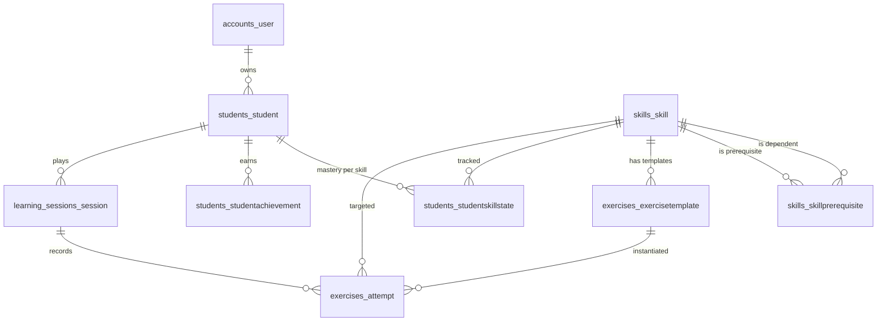

# PedagogIA

French-language adaptive math learning for Belgian FWB students (P1–P6). A parent account owns one or more student profiles; each student learns through diagnostic, drill, and free-practice modes, backed by a skill-tree DAG and AI-driven investigation of wrong answers.

- Live: <https://collegia.be>
- Project conventions: [`CLAUDE.md`](CLAUDE.md)
- Runtime & deploy architecture: [`docs/architecture.md`](docs/architecture.md)
- Production ops: [`prod/bootstrap.md`](prod/bootstrap.md)

## Quickstart

```bash
docker compose up -d          # Postgres + Django + Vite
open http://localhost:5173
```

Backend on `:8000` (Django + DRF), frontend on `:5173` (Vite), Postgres on `:5411`. API docs at `/api/docs/`.

See [`CLAUDE.md`](CLAUDE.md) for full command reference (tests, lint, seed, etc.).

## Database schema

PostgreSQL 16. Tables are grouped by Django app; app label differs from module name for `sessions` (Django label is `learning_sessions` to avoid colliding with `django.contrib.sessions`).



### `accounts_user` — parent account (AUTH_USER_MODEL)

| Column | Type | Notes |
|---|---|---|
| `id` | bigserial PK | |
| `email` | varchar, unique | login identifier |
| `display_name` | varchar(100) | |
| `password` | varchar | Django-hashed |
| `is_active`, `is_staff`, `is_superuser` | bool | |
| `date_joined`, `last_login` | timestamptz | |

### `students_student` — child profile scoped to a parent

| Column | Type | Notes |
|---|---|---|
| `id` | uuid PK | |
| `user_id` | FK → `accounts_user` ON DELETE CASCADE | |
| `display_name` | varchar(100) | |
| `grade` | varchar(2) | `P1`…`P6` |
| `created_at` | timestamptz | |
| `xp` | int ≥ 0 | gamification |
| `rank` | varchar(24) | default `curieux` |
| `current_streak`, `best_streak` | int ≥ 0 | |
| `last_activity_date` | date, null | |
| `daily_goal` | smallint ≥ 0 | default 5 |

### `students_studentskillstate` — per-student skill_xp state

| Column | Type | Notes |
|---|---|---|
| `id` | bigserial PK | |
| `student_id` | FK → `students_student` CASCADE | |
| `skill_id` | FK → `skills_skill` CASCADE | |
| `skill_xp` | float | 0.0–30.0 (check constraint); single mastery counter |
| `total_attempts` | int ≥ 0 | |
| `last_practiced_at` | timestamptz, null | |
| `updated_at` | timestamptz | |

Unique `(student_id, skill_id)`. `status` (`not_started` / `learning_easy` / `learning_medium` / `learning_hard` / `mastered` / `needs_review`), `mastery_level` (`skill_xp / 30`) and `needs_review` (`skill_xp < 20` and stale > 30 days) are Python `@property` values computed from the columns above — not stored.

### `students_studentachievement` — badges / milestones

| Column | Type | Notes |
|---|---|---|
| `id` | bigserial PK | |
| `student_id` | FK → `students_student` CASCADE | |
| `code` | varchar(48) | achievement identifier |
| `earned_at` | timestamptz | |
| `context` | jsonb | free-form payload |

Unique `(student_id, code)`.

### `skills_skill` — curriculum node (authored in `backend/src/skill_tree/skills.yaml`)

| Column | Type | Notes |
|---|---|---|
| `id` | varchar(80) PK | YAML slug, e.g. `ADD-01` |
| `label` | varchar(200) | French display name |
| `grade` | varchar(4) | `P1`…`P6` |
| `description` | text | |

### `skills_skillprerequisite` — DAG edges between skills

| Column | Type | Notes |
|---|---|---|
| `id` | bigserial PK | |
| `skill_id` | FK → `skills_skill` CASCADE | |
| `prerequisite_id` | FK → `skills_skill` CASCADE | |

Unique `(skill_id, prerequisite_id)`. Check `skill_id ≠ prerequisite_id`.

### `exercises_exercisetemplate` — parametric exercise authored in YAML

| Column | Type | Notes |
|---|---|---|
| `id` | varchar(120) PK | YAML slug |
| `difficulty` | smallint | check 1–3 |
| `input_type` | varchar(20) | `number` / `mcq` / `symbol` / `decomposition` / `point_on_line` / `drag_order` |
| `template` | jsonb | parameter ranges + answer shape |

Skills are attached via the M2M join table below — a single template can cover several skills with different weights.

### `exercises_templateskillweight` — weighted template ↔ skill link

| Column | Type | Notes |
|---|---|---|
| `id` | bigserial PK | |
| `template_id` | FK → `exercises_exercisetemplate` CASCADE | |
| `skill_id` | FK → `skills_skill` CASCADE | |
| `weight` | float | check `0 < weight ≤ 1`; weights per template expected to sum to 1 |

Unique `(template_id, skill_id)`.

### `exercises_attempt` — one student answer to one instantiated exercise

| Column | Type | Notes |
|---|---|---|
| `id` | uuid PK | |
| `session_id` | FK → `learning_sessions_session` CASCADE | |
| `template_id` | FK → `exercises_exercisetemplate` PROTECT | skill(s) derivable via `template.skills` |
| `exercise_params` | jsonb | concrete params used at instantiation |
| `student_answer`, `correct_answer` | varchar(200) | |
| `is_correct` | bool | |
| `xp_awarded` | int ≥ 0 | XP granted by this attempt (0 if wrong) |
| `responded_at` | timestamptz | `auto_now_add` |

PROTECT on `template_id` preserves attempt history even if a template is removed.

### `learning_sessions_session` — wraps a contiguous series of attempts

| Column | Type | Notes |
|---|---|---|
| `id` | uuid PK | |
| `student_id` | FK → `students_student` CASCADE | |
| `mode` | varchar(20) | `training` / `diagnostic` / `drill` / `exam` |
| `target_skill_id` | FK → `skills_skill` SET_NULL, null | skill the student chose in drill mode |
| `started_at` | timestamptz | |
| `ended_at` | timestamptz, null | |

## Notes for contributors

- Skills and exercise templates live in YAML (`backend/src/skill_tree/`) and are seeded via `seed_skills` + `seed_templates`. Edit YAML, then re-seed — never hand-edit the DB.
- `Student` profiles are always scoped to their owning `User`; all student-facing endpoints enforce ownership via `common.permissions.IsParentOwner`.
- Session authentication + CSRF. Frontend calls `/api/csrf/` before any mutating request.
